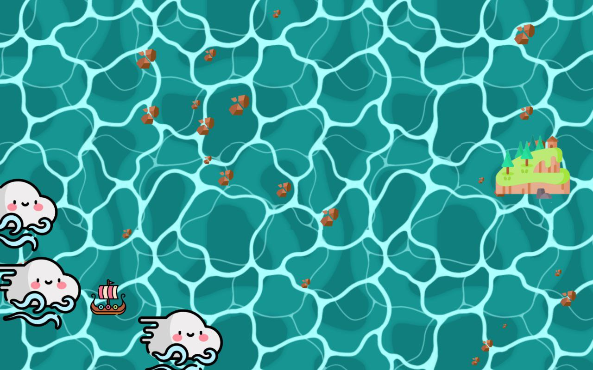
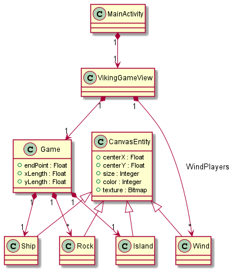

# viking-ship-app-pof
Proof of concept of a local multiplayer Android Game based in multitouch technology

## Game Rules
- 1 to * players
- To move the boat there should be at least 4 touch events.
- Move the boat to the town without any collisions

## Requirements
- 360º (can be used from any screen side)
- Have a ubiquitous nature
- Encourages the simultaneous interaction of multiple users

## Design

## Acknowledgements

Icons made by <a href="https://www.freepik.com" title="Freepik">Freepik</a> from <a href="https://www.flaticon.com/" title="Flaticon">www.flaticon.com</a>

https://www.deviantart.com/berserkitty/art/Seamless-Cartoon-styled-Water-Texture-743787929
